<div align="center">

# 👋 Hi, I'm Krevan76

<a href="https://readme-typing-svg.demolab.com">
  
</a>

**Full-Stack Developer | Game Server Infrastructure Engineer | Self-Hosting Enthusiast**
*Specialized in **Next.js** and self-hosted architectures for gaming communities.*

<p>
  <a href="https://github.com/krevan76"></a>
  
</p>

</div>

---

## 🚀 What I Do

- **Frontend & Full-Stack Web Development**
  Building modern, performant, SEO-friendly websites with **Next.js**, React, Tailwind CSS, GSAP, and TypeScript — dashboards, landing pages, and community portals.

- **Game Server Infrastructure**
  Designing and managing multi-VPS infrastructures for **FiveM (FXServer)** and **Minecraft** servers, with reverse proxies, private networking (Tailscale), and zero-trust exposure (Cloudflare Tunnel).

- **DevOps & Self-Hosting**
  Deploying and hardening Docker stacks (Dokploy, Docker Swarm), advanced firewalling (UFW, iptables/DOCKER-USER), monitoring (Beszel, Uptime Kuma), and management panels (Portainer, Pterodactyl/Wings).

- **Custom Plugin & Resource Development**
  Minecraft plugins (PaperMC) and FiveM resources (ESX/QBCore, ox_lib) tailored to specific needs: analytics, integrations, anti-cheat systems, and automation tools.

- **Discord Bot Engineering**
  Full-featured bots with Discord.js (v14+), custom transcript templates, and integrations with community panels.

---

## 🛠️ Tech Stack

```text
Next.js • React • TypeScript • Node.js • Tailwind CSS • GSAP
Docker • Docker Swarm • Dokploy • Tailscale • Cloudflare Tunnel
FiveM (FXServer) • ESX/QBCore • ox_lib • oxmysql
PaperMC • Pterodactyl/Wings • Discord.js • Python (utilities)
Nginx • UFW/iptables • Portainer • Uptime Kuma
```

---

## 📊 Stats

<div align="center">




</div>

---

## 📬 Get in Touch

💼 GitHub: github.com/krevan76 (you're here!)
💻 Discord: itskrevan
